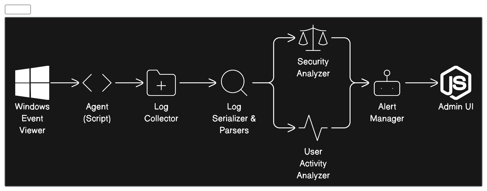

# LogWarp System Architecture

Develop a log analysis system for Windows that focuses on security event logs.
The system should parse and analyze logs generated by Windows Security, Application, and
System event logs to identify and alert on potential security incidents, such as unauthorized
access attempts, malware activity, or policy violations.

Overview:

- Windows machines generate various log files that contain rich information about system activities and events. Security, Application, and System event logs often contain clues about security incidents.
- The goal is to build a log analysis system that can automatically parse these logs, detect anomalies and patterns indicative of security issues, and generate alerts.
Components:

- Log Collector: An agent runs on each Windows machine to collect Security, Application, and System event logs and ship them to the central analysis system. The agent compresses and encrypts the log files for efficient transfer.
- Central Log Repository: A scalable data store for storing the raw log files shipped from agents. Could use a distributed file system like HDFS or object storage like S3.
- Log Parser: Parses raw log files and extracts relevant events, timestamps, metadata, etc. Knows how to parse Windows event log formats. Outputs structured log data.
- Rules Engine: Applies a set of rules to detect known attack patterns, anomalies, suspicious events, policy violations, etc. Rules can be updated to detect new types of attacks. Outputs alerts.
- Machine Learning: Analyzes log data over time to detect unusual activity patterns that could indicate attacks, issues, or policy violations. Reinforced learning can adapt models to new behaviors.
- Search & Alert Interface: Allows security analysts to search log data and review alerts. Users can tune rules and machine learning models to improve accuracy.
- Admin Interface: To manage agents, rules, and analyzers.
The system will scale by adding more storage and compute for the central analysis components. The agent collectors run locally on each Windows machine to retrieve logs.

